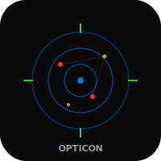
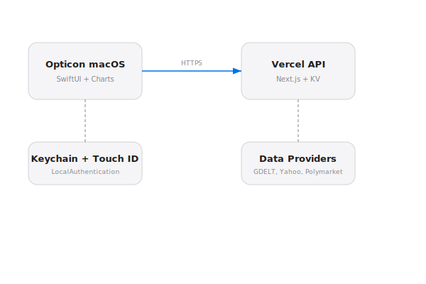

# Opticon macOS


Native macOS companion for [Opticon](https://opticon.heyitsmejosh.com). Financial terminal with a live map, markets, prediction markets, portfolio tracking, alerts, and account settings.

## Features

- **Map** -- Interactive MapKit view with device location, earthquakes, flights, incidents, and per-source toggles
- **Markets** -- Stocks, commodities, crypto in a sortable table with search, P/E and market-cap columns, and a scrolling marquee ticker with hover-to-pause
- **Predictions** -- Polymarket prediction markets
- **Portfolio** -- Holdings, spending forecast (Charts), budget, debt, goals, statements
- **Alerts** -- Price alerts with create/delete
- **Auth** -- Login, register, Touch ID (LocalAuthentication), Keychain persistence, saved credentials
- **Settings** -- Card-based layout with profile, subscription tiers, account actions, map source toggles, and danger zone
- **Keyboard Shortcuts** -- Cmd+1 through Cmd+5 to switch tabs

## Build

```
xcodegen generate
xcodebuild -project Opticon.xcodeproj -scheme Opticon -destination 'platform=macOS' build
```

Requires macOS 14+, Swift 6.0, Xcode 26+.

## Architecture



macOS app talks to the Vercel API (same backend as web + iOS). Auth is stored in Keychain with optional Touch ID unlock. The shell uses a bottom tab bar with Cmd+1-5 keyboard shortcuts, the map uses viewport-driven reloads, and the markets ticker scrolls as a marquee (pauses on hover). Settings uses a card-based ScrollView layout. The Markets view supports in-place resorting by symbol, name, price, P/E, market cap, and daily change.

## License

MIT 2026, Joshua Trommel
